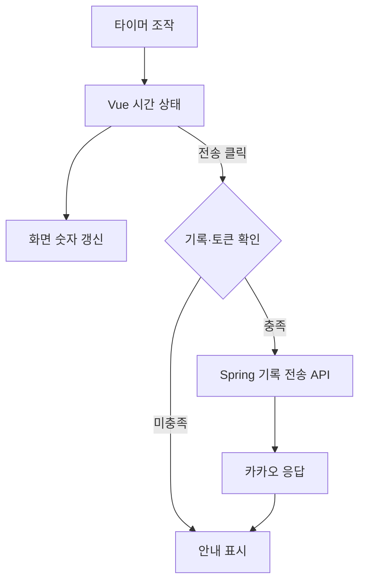

# StopWatch — screen-code-handover 업데이트 인수인계

한국시간 2026년 9월 18~19일 업데이트 보고서. 활동 집계 마감은 9월 19일 21:24:15입니다.

스탑워치·집중 타이머와 카카오 기록 전송을 다루는 프로젝트입니다. 이번에는 PDF 중심 문서를 Markdown·화면 이미지가 있는 인수인계 묶음으로 보강했습니다.

| 항목 | 기준 |
|---|---|
| 보고서 범위 | 이번 기간의 변경과 관련 기능. 전체 시스템 설명은 아래 기존 상세 문서로 연결합니다. |
| 확인 브랜치 | main |
| 소스 기준 | `1e2ae7e87e21` |
| 검증 범위 | 문서 변경 이력과 타이머 컴포넌트, package.json을 대조했습니다. dev가 호출하는 concurrently·wait-on의 선언 누락을 확인했습니다. |
| 보고서 세트 | [쉬운 설명](easy-guide.md) · [수정·검증 지시](fix-guide.md) · [코드 인수인계](screen-code-handover.md) |

## 이번 변경의 경계

- 9월 18일 PR #1로 첫 인수인계 PDF를 추가했습니다.
- 9월 19일 PR #2로 Markdown, PDF, 전체·부분 화면 이미지를 추가했습니다. 앱 소스 변경은 없습니다.

기존 보고서가 저장소 원본 캡처를 바탕으로 정리한 메인 화면입니다. 이번 작업에서 새로 실행·캡처한 화면은 아닙니다.

## 핵심 파일과 역할

| 핵심 파일 | 함수·컴포넌트 | 담당 역할 |
|---|---|---|
| [MyVueApp/my-pwa-app/src/components/Stopwatch.vue](https://github.com/feed-mina/StopWatch/blob/1e2ae7e87e218747dbfda3a5458170308a69ed85/MyVueApp/my-pwa-app/src/components/Stopwatch.vue) | Stopwatch 컴포넌트 | 측정 시간과 시작·정지·초기화 동작을 관리합니다. 기록 전송은 별도 요청입니다. |
| [MyVueApp/my-pwa-app/src/components/PomodoroTimer.vue](https://github.com/feed-mina/StopWatch/blob/1e2ae7e87e218747dbfda3a5458170308a69ed85/MyVueApp/my-pwa-app/src/components/PomodoroTimer.vue) | PomodoroTimer 컴포넌트 | 집중 시간과 회차 상태를 관리합니다. 타이머 상태와 서버 전송을 구분합니다. |
| [MyVueApp/my-pwa-app/package.json](https://github.com/feed-mina/StopWatch/blob/1e2ae7e87e218747dbfda3a5458170308a69ed85/MyVueApp/my-pwa-app/package.json) | scripts.dev | Vite와 Electron을 함께 실행합니다. 실행에 필요한 도구 선언을 확인하는 위치입니다. |

## 입력·처리·반환과 부수 효과

| 담당 기능 | 입력 | 처리와 분기 | 반환·출력 | 별도로 일어나는 변경 |
|---|---|---|---|---|
| Stopwatch | 버튼 이벤트와 시간 상태 | 시간 증가·정지·초기화 | 화면에 표시되는 시간 | 타이머 핸들·브라우저 상태 변경 |
| 기록 전송 | 측정 시간과 로그인 토큰 | /api/kakao/sendRecord 호출 | 성공·실패 안내 | 외부 카카오 전송 요청 |
| scripts.dev | npm run dev | Vite 기동과 대기 후 Electron 시작 | 개발 창과 개발 서버 | 로컬 프로세스 실행 |

## 동작 흐름

화살표는 호출·데이터 전달 또는 조건 분기를 뜻합니다. 도식에 없는 운영 연결은 확인되지 않았습니다.

## 데이터와 연결 관계

| 저장·전달 대상 | 주요 값 | 관계와 주의점 |
|---|---|---|
| 브라우저 상태 | 시간·로그인 관련 값 | 측정 값과 인증 정보를 혼동하지 않습니다. |
| 전송 body | stopwatchTime,pomodoroCount,pomodoroTotalTime | 서버 메시지 구성용 값입니다. |
| 서버 DB | 이번 타이머 기록 저장 경로 없음 | 기존 문서 기준으로 DB 영구 저장 기능이라고 설명하지 않습니다. |

## 유지보수와 확인 순서

| 바꾸거나 확인할 것 | 확인 위치와 기준 |
|---|---|
| 개발 실행 | package.json의 dev와 devDependencies를 같이 맞춥니다. |
| 타이머 조작 | 타이머 핸들 중복 생성·정지·초기화와 UI 결과를 확인합니다. |
| 기록 전송 | 로컬 UI 성공과 실제 카카오 전송을 분리해 검증합니다. |

개발 폴더는 `MyVueApp/my-pwa-app`입니다. 선언된 빌드는 `npm run build`입니다. 카카오 전송을 실행하지 않고 문서·컴포넌트를 검토했습니다.

## 검증 결과와 남은 범위

문서 변경 이력과 타이머 컴포넌트, package.json을 대조했습니다. dev가 호출하는 concurrently·wait-on의 선언 누락을 확인했습니다.

깨끗한 설치 환경에서의 전체 빌드·데스크톱 실행과 카카오 전송은 이번에 실행하지 않았습니다.

## 기존 상세 문서와 활동 근거

- [기존 상세 인수인계](https://github.com/feed-mina/StopWatch/blob/1e2ae7e87e218747dbfda3a5458170308a69ed85/docs/%EC%9C%A0%EC%A7%80%EB%B3%B4%EC%88%98_%EB%B0%8F_%EC%9D%B8%EC%88%98%EC%9D%B8%EA%B3%84_%EB%AC%B8%EC%84%9C.md)

| 한국시간 | 커밋 | 기록된 작업 | 구분 |
|---|---|---|---|
| 09/19 10:45 | [1e2ae7e](https://github.com/feed-mina/StopWatch/commit/1e2ae7e87e218747dbfda3a5458170308a69ed85) | Merge pull request #2 from feed-mina/copilot/screen-code-handover | 병합 기록 |
| 09/19 10:30 | [68ab3d7](https://github.com/feed-mina/StopWatch/commit/68ab3d75eef64a66498bbb19162dade2a2dbd85d) | Add visual maintenance handover documentation package | 변경 기록 |
| 09/18 18:59 | [6f7a497](https://github.com/feed-mina/StopWatch/commit/6f7a497a1b85485053d5b50805fc8e7d871be9d8) | Merge pull request #1 from feed-mina/copilot/create-handover-documentation | 병합 기록 |
| 09/18 18:57 | [4aded41](https://github.com/feed-mina/StopWatch/commit/4aded41f097f75f69f5dcebb464e338f30ea9653) | docs: add screen-code handover PDF | 변경 기록 |
