# 유지보수 및 인수인계 문서

## 문서 안내

| 항목 | 내용 |
|---|---|
| 대상 | 프로젝트를 처음 맡는 개발자 |
| 저장소 | `feed-mina/StopWatch` |
| 분석 브랜치 | `copilot/screen-code-handover` |
| 범위 | 프런트엔드(Vue+Electron), 백엔드(Spring Boot), 데이터 저장/전송 경로, 유지보수 절차 |
| 읽는 순서 | 1) 전체 구조 → 2) 화면/컴포넌트 → 3) 함수 계약/흐름도 → 4) API/데이터 → 5) 유지보수 |
| 결과물 | 본 Markdown + 동일 내용 PDF + 연결 이미지 |

### 목차
- [1. 전체 구조](#1-전체-구조)
- [2. 화면과 컴포넌트](#2-화면과-컴포넌트)
- [3. 핵심 파일과 기능](#3-핵심-파일과-기능)
- [4. 함수 계약(입력·처리·반환·부수 효과)](#4-함수-계약입력처리반환부수-효과)
- [5. 동작 흐름도(실제 조건 분기)](#5-동작-흐름도실제-조건-분기)
- [6. 역할 관계도](#6-역할-관계도)
- [7. API 연계](#7-api-연계)
- [8. DB 스키마와 ERD](#8-db-스키마와-erd)
- [9. 유지보수 절차](#9-유지보수-절차)
- [10. 트러블슈팅 가이드](#10-트러블슈팅-가이드)

---

## 1. 전체 구조

이 프로젝트는 **Vue 3 단일 페이지 앱**(웹/PWA + Electron 포장)과 **Spring Boot API 서버**로 구성됩니다. 화면에서 측정된 시간 데이터는 서버 DB에 저장되지 않고, 필요 시 카카오 API로 메시지 전송됩니다.

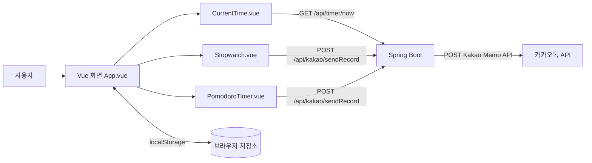

---

## 2. 화면과 컴포넌트

### 2.1 메인 화면(라이트)
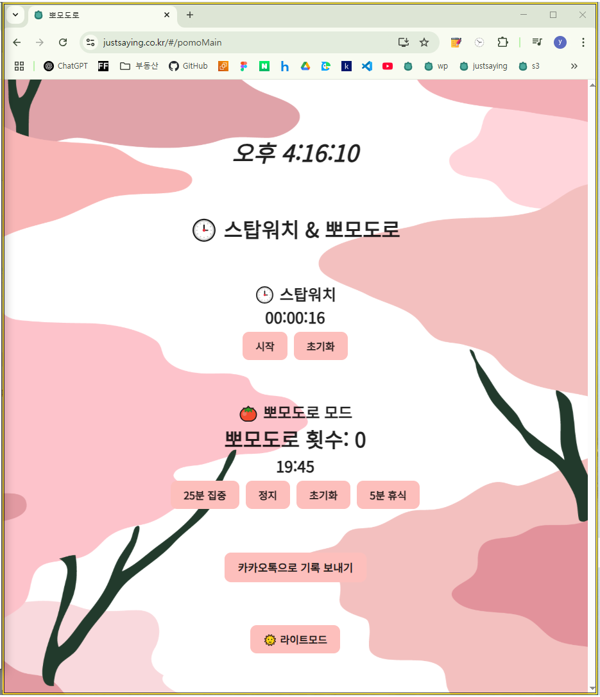

- 상단 현재시간, 중앙 스탑워치, 하단 뽀모도로·기록 전송·다크모드 토글이 배치됩니다.
- 사용자 입력은 버튼 클릭 중심이며, 결과는 타이머 숫자·세션 카운트·알림(Notyf)으로 표시됩니다.

### 2.2 메인 화면(다크)
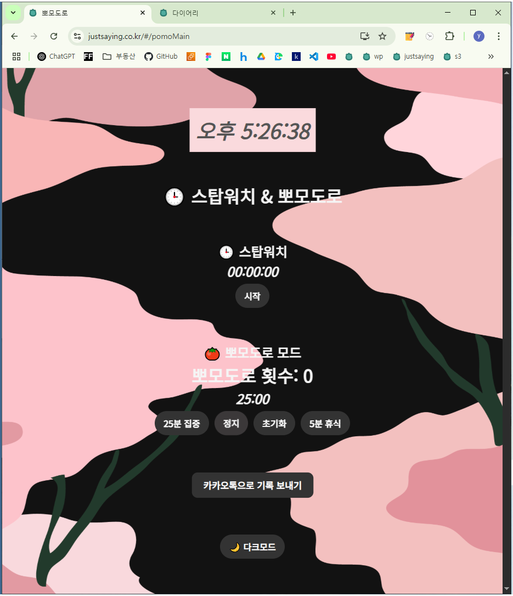

- 동일 기능을 다크 테마로 표시하며, 토글 시 `document.documentElement.classList`가 변경됩니다.

### 2.3 카카오 기록 전송 화면
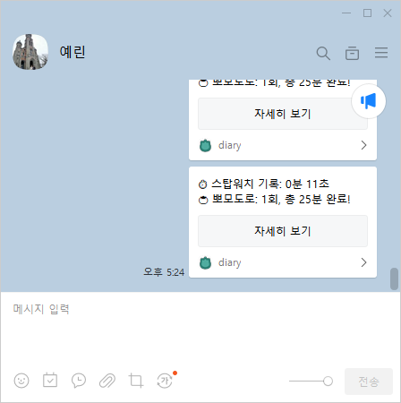

- 카카오 전송 성공/실패 피드백이 토스트로 표시됩니다.
- 전송 데이터는 스탑워치 초, 뽀모도로 횟수/총분입니다.

### 2.4 설명용 컴포넌트 이미지

#### 현재시간 영역
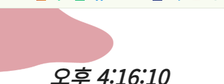

#### 스탑워치 영역
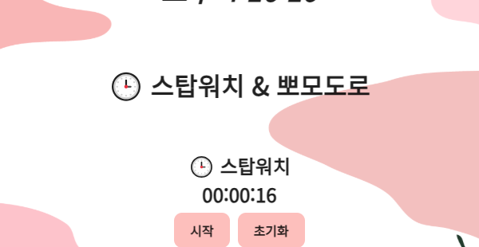

#### 뽀모도로 영역
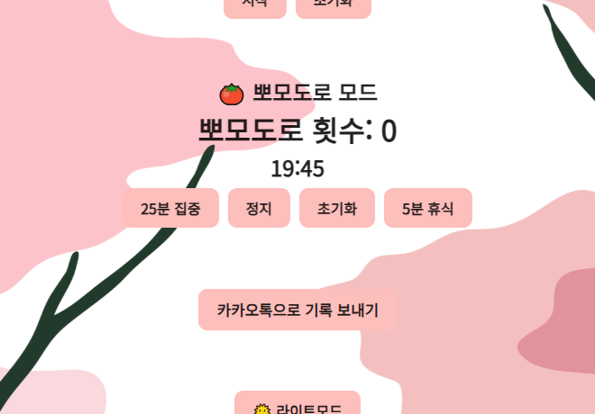

#### 카카오 전송 + 다크모드 토글 영역

> 이미지 출처: 저장소 루트의 실제 캡처 PNG를 기반으로 전체/영역을 분리했습니다.

---

## 3. 핵심 파일과 기능

### 프런트엔드
- `/home/runner/work/StopWatch/StopWatch/MyVueApp/my-pwa-app/src/App.vue`  
  로그인 여부(`isLogin`)에 따라 로그인 화면과 메인 화면을 분기하고, 스탑워치/뽀모도로 공유 상태를 `provide`로 하위 컴포넌트에 전달합니다.
- `/home/runner/work/StopWatch/StopWatch/MyVueApp/my-pwa-app/src/components/LoginView.vue`  
  카카오 JS SDK를 로드하고 로그인 성공 시 access token을 localStorage에 저장한 뒤 상위로 성공 이벤트를 전달합니다.
- `/home/runner/work/StopWatch/StopWatch/MyVueApp/my-pwa-app/src/components/MainView.vue`  
  서버 시간 연결 체크, 전체 기록 전송, 다크모드 토글을 담당하며 화면 조립 컴포넌트 역할을 합니다.
- `/home/runner/work/StopWatch/StopWatch/MyVueApp/my-pwa-app/src/components/Stopwatch.vue`  
  초 단위 스탑워치를 시작/정지/초기화하고 필요 시 카카오 기록 API로 스탑워치 기록을 전송합니다.
- `/home/runner/work/StopWatch/StopWatch/MyVueApp/my-pwa-app/src/components/PomodoroTimer.vue`  
  25분 집중/5분 휴식 타이머와 세션 증가 로직을 처리하고 완료 기록 전송에 필요한 뽀모도로 데이터를 구성합니다.
- `/home/runner/work/StopWatch/StopWatch/MyVueApp/my-pwa-app/src/components/CurrentTime.vue`  
  설정값에 따라 서버 시간 API 또는 로컬 시간을 1초 주기로 갱신해 표시합니다.
- `/home/runner/work/StopWatch/StopWatch/MyVueApp/my-pwa-app/electron/main.cjs`  
  Electron BrowserWindow를 띄우고 카카오 SDK 동작을 위한 CSP 헤더를 구성합니다.

### 백엔드
- `/home/runner/work/StopWatch/StopWatch/MyJavaApp/MyJavaApp/src/main/java/com/my/app/myjavaapp/controller/TimeController.java`  
  현재 시각 문자열을 반환하는 단일 API를 제공합니다.
- `/home/runner/work/StopWatch/StopWatch/MyJavaApp/MyJavaApp/src/main/java/com/my/app/myjavaapp/controller/KakaoController.java`  
  카카오 로그인 URL 생성, 콜백 토큰 교환, 기록 메시지 조합 후 카카오 나에게 보내기 API 호출을 처리합니다.
- `/home/runner/work/StopWatch/StopWatch/MyJavaApp/MyJavaApp/src/main/java/com/my/app/myjavaapp/config/WebConfig.java`  
  전체 경로 CORS 허용 정책을 설정합니다.
- `/home/runner/work/StopWatch/StopWatch/MyJavaApp/MyJavaApp/src/main/resources/application.properties`  
  서버 포트/SSL 사용 여부와 카카오 연동 키, 리다이렉트 URI를 관리합니다.

---

## 4. 함수 계약(입력·처리·반환·부수 효과)

### 4.1 로그인/세션

| 화면 요소 | 함수(파일) | 입력 | 처리 | 반환/출력 | 부수 효과 |
|---|---|---|---|---|---|
| 카카오 로그인 버튼 | `kakaoLogin` (`LoginView.vue`) | 사용자 클릭, Kakao SDK 객체 | `Kakao.Auth.login` 호출 | 성공 시 `authObj` | `localStorage.kakaoAccessToken` 저장, `loginSuccess` emit |
| 앱 초기 진입 | `onMounted` (`App.vue`) | `localStorage.isLogin` | 로그인 상태 복원/다크모드 초기화 | 렌더링 분기값 변경 | `documentElement.classList` 변경 |
| 로그아웃 버튼(상위 이벤트) | `handleLogout` (`App.vue`) | 사용자 클릭 | 로그인 상태 false 처리 | LoginView 전환 | `isLogin` 제거, 다크모드 class 제거 |

### 4.2 스탑워치

| 화면 요소 | 함수(파일) | 입력 | 처리 조건 | 반환/출력 | 부수 효과 |
|---|---|---|---|---|---|
| 시작 버튼 | `startTimer` (`Stopwatch.vue`) | 클릭 | interval 없을 때만 생성 | 1초마다 시간 증가 | `stopwatchSeconds++`, 알람 재생 예약 |
| 정지 버튼 | `stopTimer` | 클릭 | 실행 중 interval 존재 시 정지 | 시간 증가 중단 | interval 해제, 정지 알람 예약 |
| 초기화 버튼 | `resetTimer` | 클릭 | 항상 수행 가능(표시는 조건부) | 시간 0 | `stopwatchSeconds=0` |
| 기록 전송 | `sendStopwatchTimeRecord` | 클릭, token, 초 값 | 기록 없음/토큰 없음/HTTP 오류 분기 | 성공·실패 토스트 | 401 시 로그인 URL 이동 시도 |

### 4.3 뽀모도로

| 화면 요소 | 함수(파일) | 입력 | 처리 조건 | 반환/출력 | 부수 효과 |
|---|---|---|---|---|---|
| 25분 집중 버튼 | `startPomodoro` (`PomodoroTimer.vue`) | 클릭 | 이미 실행 중이면 조기 종료 | 카운트다운 시작 | `isPomodoroRunning=true`, 완료 시 `pomoSession++` |
| 정지 버튼 | `stopPomodoro` | 클릭 | interval 존재 시 정지 | 카운트다운 중단 | interval 해제, 상태 false |
| 초기화 버튼 | `resetPomodoro` | 클릭 | 항상 수행 | 25분으로 복원 | 정지 + 알람 |
| 5분 휴식 버튼 | `startBreak` | 클릭 | 기존 interval 정리 후 휴식 타이머 시작 | 휴식 카운트다운 | 종료 시 성공 알림 |
| 기록 전송(주석 처리된 버튼 함수) | `sendPomodoroTimerRecord` | 클릭, token, 세션값 | 기록/토큰 유효성 검사 | 성공·실패 토스트 | 요청 본문에 횟수·총분 전송 |

### 4.4 서버 API

| API | 메서드 | 입력 | 처리 | 반환 | 부수 효과 |
|---|---|---|---|---|---|
| `/api/timer/now` | GET | 없음 | 서버 현재시각 포맷 | `yyyy-MM-dd HH:mm:ss` 문자열 | 없음 |
| `/api/kakao/login` | GET | 없음 | 인가 URL 조합 | 카카오 인가 URL 문자열 | 로그 출력 |
| `/api/kakao/callback` | GET | `code` | 토큰 교환 요청 | 발급 결과 문자열 | 서버 메모리 `accessToken` 갱신 |
| `/api/kakao/sendRecord` | POST | `Authorization: ****** JSON body | 기록 메시지 조합 후 카카오 API 호출 | 성공/실패 문자열 | 외부 카카오톡 메시지 전송 |

---

## 5. 동작 흐름도(실제 조건 분기)

### 5.1 전체 기록 전송(MainView)

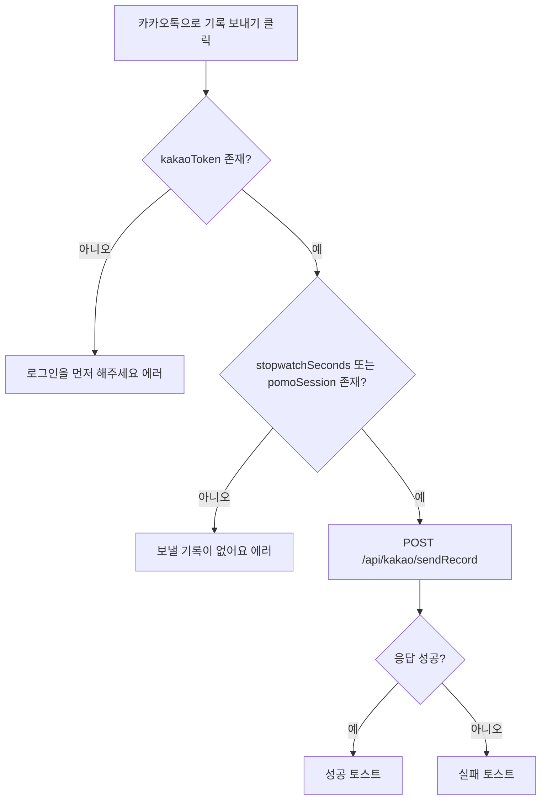

### 5.2 뽀모도로 시작/완료

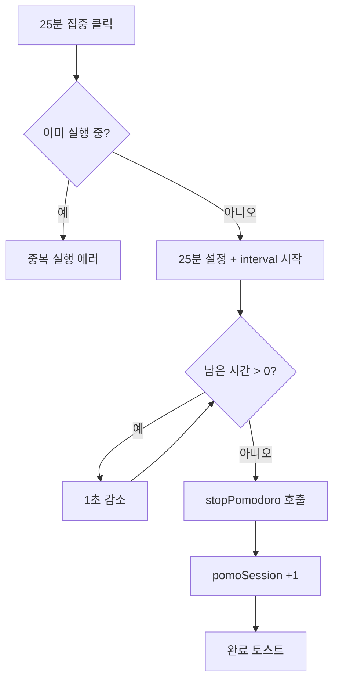

### 5.3 백엔드 기록 전송

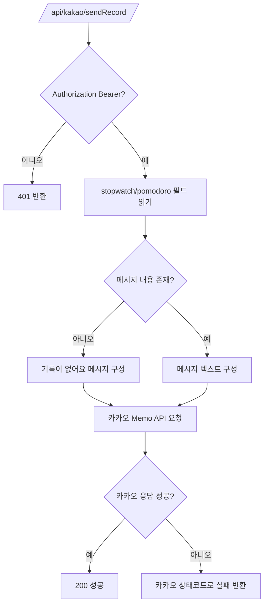

---

## 6. 역할 관계도

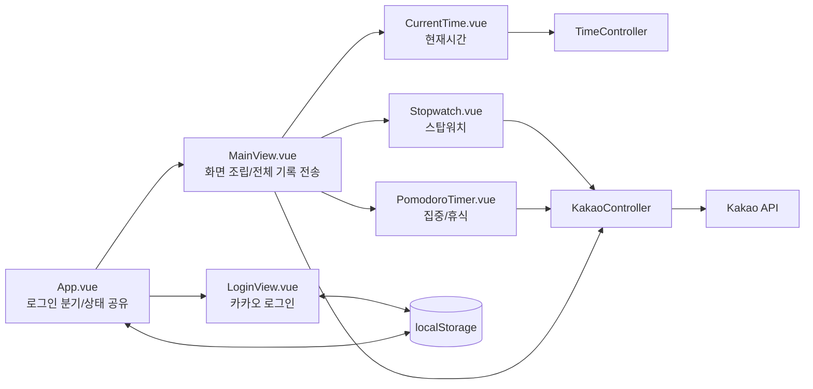

화살표 의미:
- 실선: 함수 호출/컴포넌트 렌더링 의존
- `component -> controller`: HTTP 요청
- `controller -> external`: 외부 API 호출
- `<-> localStorage`: 상태 읽기/쓰기

---

## 7. API 연계

| 사용 화면 | API 경로 | 메서드 | 요청 필드 | 응답 필드 | 비고 |
|---|---|---|---|---|---|
| CurrentTime, MainView 연결체크 | `http://localhost:8080/api/timer/now` | GET | 없음 | 문자열 시간 | 시간 표시/서버 연결 확인 |
| MainView 전체 기록 전송 | `http://localhost:8080/api/kakao/sendRecord` | POST | Header: `Authorization: ****** Body: `stopwatchTime`, `pomodoroCount`, `pomodoroTotalTime` | 성공/실패 문자열 | 카카오톡 전송 트리거 |
| Stopwatch 단일 전송 | `http://localhost:8080/api/kakao/sendRecord` | POST | Body: `stopwatchTime` | 성공/실패 문자열, 에러 시 상태코드 | 401/500 분기 처리 포함 |
| Pomodoro 전송 함수 | `http://localhost:8080/api/kakao/sendRecord` | POST | Body: `pomodoroCount`, `pomodoroTotalTime` | 성공/실패 문자열 | 현재 템플릿에서 버튼 주석 처리 |
| 백엔드 카카오 로그인 | `/api/kakao/login` | GET | 없음 | 카카오 인가 URL 문자열 | 필요 시 프런트 리디렉션에 사용 가능 |
| 백엔드 카카오 콜백 | `/api/kakao/callback` | GET | `code` | 토큰 발급 결과 문자열 | 서버 메모리 토큰 갱신 |

---

## 8. DB 스키마와 ERD

### 8.1 실제 DB 사용 여부
- 저장소 코드 기준으로 **MySQL/JPA/Entity/Repository 사용 코드는 확인되지 않았습니다.**
- 즉, 현재 구현은 **서버 DB 테이블을 읽거나 쓰지 않고**, 클라이언트 상태 + 카카오 API 전송 중심입니다.

### 8.2 실제 저장 구조(현재 코드 기준)

#### 브라우저 localStorage
| 키 | 타입 | 필수 | 기본값 | 생성/수정 위치 | 사용 화면 |
|---|---|---|---|---|---|
| `isLogin` | String(`"true"`) | 아니오 | 없음 | `App.vue` | 로그인 분기 |
| `kakaoAccessToken` | String | 아니오 | 없음 | `LoginView.vue` | 기록 전송 인증 헤더 구성 |

#### 서버 메모리 필드
| 필드 | 타입 | 위치 | 역할 |
|---|---|---|---|
| `accessToken` | `String` | `KakaoController` 인스턴스 필드 | 콜백 후 임시 저장, 카카오 전송 시 참조 |

### 8.3 전체 ERD(현재 구현 관점)

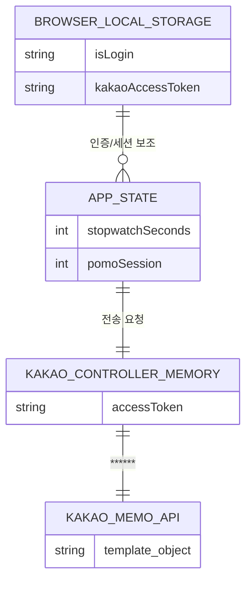

### 8.4 기능별 ERD

#### 기록 전송 기능
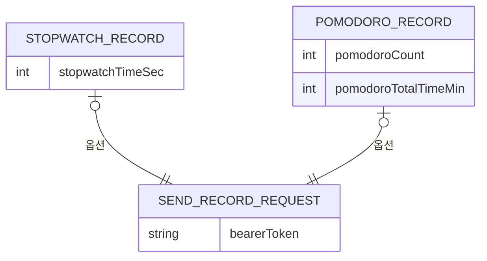

> 외래키 제약: 현재 코드 기준 실제 RDB 테이블이 없어 해당 없음.  
> 논리 연결: 화면 상태값 → JSON body → 카카오 메시지 텍스트 조합.

---

## 9. 유지보수 절차

### 9.1 환경 설정

#### 프런트엔드 위치
- 작업 디렉터리: `/home/runner/work/StopWatch/StopWatch/MyVueApp/my-pwa-app`
- 주요 환경값: `.env` / `.env.production`
  - `VITE_APP_USE_API=true` (CurrentTime API 사용 분기)
  - `VITE_KAKAO_JS_KEY=...` (카카오 JS SDK 초기화 키)

#### 백엔드 위치
- 작업 디렉터리: `/home/runner/work/StopWatch/StopWatch/MyJavaApp/MyJavaApp`
- 주요 환경값: `src/main/resources/application.properties`
  - `server.port=8080`
  - `KAKAO_CLIENT_ID`, `KAKAO_REDIRECT_URI`

### 9.2 로컬 실행

| 구분 | 실행 위치 | 명령 | 성공 확인 |
|---|---|---|---|
| 백엔드 | `.../MyJavaApp/MyJavaApp` | `chmod +x gradlew` 후 `./gradlew bootRun` | `http://localhost:8080/api/timer/now` 호출 시 시간 문자열 반환 |
| 프런트 빌드 | `.../MyVueApp/my-pwa-app` | `npm install` 후 `npm run build` | `dist/` 생성 및 오류 없음 |
| 프런트 개발서버(권장 보완 필요) | 동일 | 현재 `npm run dev`는 `concurrently` 의존 누락 시 실패 가능 | `http://localhost:5173` 접속 가능 시 성공 |

> 실행 확인 결과와 절차를 구분: 위 명령은 저장소 기준 절차이며, 환경 의존 패키지 누락 시 보완 설치가 필요합니다.

### 9.3 변경 위치 가이드
- 로그인/권한: `LoginView.vue`, `App.vue`, `KakaoController.java`
- 시간 표시: `CurrentTime.vue`, `TimeController.java`
- 타이머 동작: `Stopwatch.vue`, `PomodoroTimer.vue`
- 기록 전송 포맷: `MainView.vue`, `KakaoController.java`
- 데스크톱 패키징/CSP: `electron/main.cjs`

### 9.4 테스트·빌드
- 프런트: `npm run build`
- 백엔드: `./gradlew test`, `./gradlew build`
- 점검 포인트:
  1. 로그인 후 `kakaoAccessToken` 저장 확인
  2. 스탑워치/뽀모도로 값 증가 확인
  3. `/api/timer/now` 응답 확인
  4. `/api/kakao/sendRecord` 성공/에러 분기 확인

### 9.5 배포·복구
- README에 S3/EC2 배포 언급은 있으나, 저장소 내 자동화 스크립트/워크플로는 확인되지 않았습니다.
- 따라서 현재 확인 가능한 범위는 **로컬 빌드 및 수동 실행 절차**까지입니다.
- 복구 시 권장 순서:
  1. 마지막 정상 커밋으로 코드 복원
  2. 백엔드 API 응답 확인(`/api/timer/now`)
  3. 프런트 빌드 재확인(`npm run build`)
  4. 카카오 키/리다이렉트 URI 재검증

---

## 10. 트러블슈팅 가이드

| 증상 | 1차 확인 | 원인 후보 | 조치 |
|---|---|---|---|
| 현재 시간이 안 보임 | `/api/timer/now` 응답 확인 | 백엔드 미기동, CORS/네트워크 문제 | 백엔드 실행 후 콘솔 에러 확인 |
| 카카오 로그인 버튼 무반응 | 브라우저 콘솔 | Kakao SDK 로드 실패, JS 키 오류 | SDK script 로드 상태 및 `VITE_KAKAO_JS_KEY` 확인 |
| 기록 전송 실패(401) | 응답 상태코드 | 토큰 없음/만료, ****** 누락 | 재로그인 후 토큰 갱신 |
| 기록 전송 실패(500) | 백엔드 로그 | 카카오 연동 설정값 문제 | `application.properties`의 카카오 설정 확인 |
| 프런트 dev 실행 실패 | 터미널 에러 메시지 | `concurrently`/`wait-on` 누락 | dev 스크립트 의존 패키지 설치 또는 스크립트 정리 |
| Electron에서 외부 스크립트 차단 | DevTools 네트워크/CSP 에러 | CSP 정책 누락 | `electron/main.cjs` CSP 항목 수정 |

---

## 11. 산출물 검수 기록

- Markdown 내부 링크: 목차 앵커 링크 기준 점검 완료
- 이미지 상대 경로: `./images/handover/...` 기준 점검 완료
- 화면 번호/제목 일관성: 메인(라이트/다크), 카카오 전송, 컴포넌트 영역으로 통일
- 구성 범위: 프런트엔드·백엔드·데이터 경로·유지보수 절차 포함

